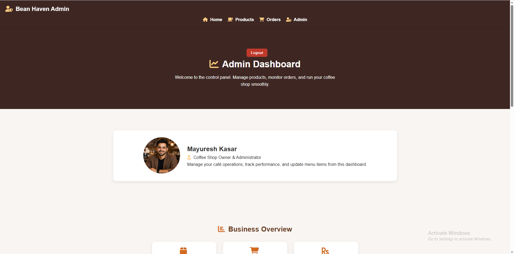

# ☕ Coffee Shop Full Stack Web Application

A complete **Full Stack Coffee Shop Web Application** built using **HTML, CSS, JavaScript, Node.js, Express.js, and MySQL**.

This project simulates a real-world café system with product management, order processing, contact handling, and admin authentication. It demonstrates full-stack development skills including frontend UI design, backend API development, and database integration.

---

## 🚀 Live Demo

**Frontend (GitHub Pages):**
https://mayuresh-2601.github.io/Coffee-Shop/

**GitHub Repository:**
https://github.com/mayuresh-2601/Coffee-Shop

---

## 📌 Project Overview

This application represents a modern coffee shop website where users can:

* Browse coffee products
* Place orders
* Submit contact messages
* Access admin login
* Manage products via backend API
* Store data in MySQL database

The project is designed as a **portfolio-ready full-stack system** suitable for:

* Internship roles
* Junior Developer roles
* Entry-Level Full Stack Developer positions

---
---

## 📸 Screenshots

### 🏠 Home Page


---

### ☕ Products Page


---

### 🛒 Order Page


---

### 🔐 Admin Login


---

### 📊 Admin Dashboard



---

## 🛠️ Technologies Used

### Frontend

* HTML5
* CSS3
* JavaScript
* Responsive Design
* Flexbox & Grid
* Font Awesome

### Backend

* Node.js
* Express.js
* REST API
* Middleware
* JWT Authentication

### Database

* MySQL
* SQL Queries
* Database Integration

### Tools

* Git
* GitHub
* VS Code
* Nodemon
* Postman

---

## 🎯 Key Features

### User Features

* Browse coffee menu
* Place orders
* Contact form submission
* Responsive website design
* Interactive UI animations

### Admin Features

* Admin login authentication
* Add new products
* Secure API endpoints
* Database storage
* Protected routes using middleware

### System Features

* REST API architecture
* Modular backend structure
* Environment configuration
* Error handling
* Secure database queries

---

## 📂 Project Structure

```
Coffee-Shop/

backend/
│
├── config/
│   └── db.js
│
├── controllers/
│   ├── authController.js
│   ├── productController.js
│   ├── orderController.js
│   └── contactController.js
│
├── middleware/
│   └── authMiddleware.js
│
├── routes/
│   ├── authRoutes.js
│   ├── productRoutes.js
│   ├── orderRoutes.js
│   └── contactRoutes.js
│
├── server.js
├── package.json
└── .env

css/
js/
image/
database/
    bean_haven.sql

HTML Pages:
    index.html
    about.html
    products.html
    order.html
    payment.html
    blog.html
    career.html
    contact.html
    admin.html
    admin-login.html
```

---

## ⚙️ Installation & Setup

### Step 1 — Clone Repository

```
git clone https://github.com/mayuresh-2601/Coffee-Shop.git
```

### Step 2 — Navigate to Project

```
cd Coffee-Shop
```

### Step 3 — Install Backend Dependencies

```
cd backend
npm install
```

### Step 4 — Create Environment File

Create `.env` file inside backend:

```
PORT=5000

DB_HOST=localhost
DB_USER=root
DB_PASSWORD=
DB_NAME=bean_haven

JWT_SECRET=coffee_secret_key
```

### Step 5 — Import Database

Open:

```
http://localhost/phpmyadmin
```

Create database:

```
bean_haven
```

Import:

```
database/bean_haven.sql
```

### Step 6 — Run Server

```
npm run dev
```

Server will run on:

```
http://localhost:5000
```

---

## 🔌 API Endpoints

### Authentication

```
POST /api/auth/login
```

### Products

```
POST /api/products/add
```

### Orders

```
POST /api/orders/add
```

### Contacts

```
POST /api/contacts/add
```

---

## 🔐 Security Features

* Password hashing using bcrypt
* JWT authentication
* Protected routes using middleware
* Environment variables
* SQL prepared statements

---

## 📊 Core Functionalities

### Product Management

* Add new products
* Store product data
* Retrieve product information

### Order System

* Create customer orders
* Save order details
* Validate input fields

### Contact System

* Submit contact messages
* Store customer inquiries

### Authentication

* Admin login verification
* Session protection
* Token-based security

---

## 📈 What This Project Demonstrates

* Full Stack Web Development
* REST API Development
* Backend Architecture
* Database Integration
* Authentication System
* Real-world Project Structure
* Git Version Control
* Debugging and Problem Solving

---

## 🔮 Future Improvements

* User registration system
* Update / delete product APIs
* Payment gateway integration
* Admin dashboard analytics
* Order tracking system
* Role-based authentication
* Deployment to cloud server

---

## 👨‍💻 Author

**Mayuresh Kasar**
Full Stack Web Developer

GitHub:
https://github.com/mayuresh-2601

---

## ⭐ Support

If you found this project helpful, please give it a ⭐ on GitHub.
