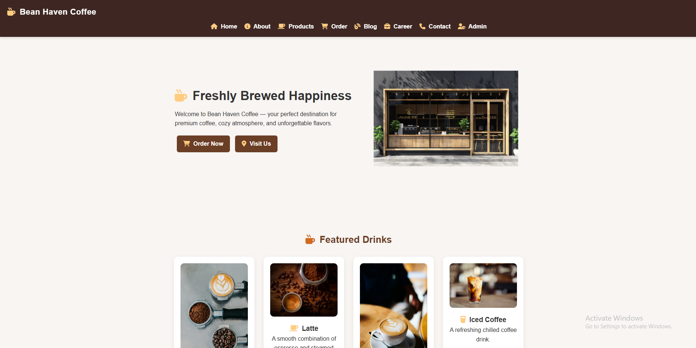

# ☕ Bean Haven Coffee – Full Stack Coffee Shop Web Application

 

---

## 📌 Project Overview

**Bean Haven Coffee** is a full-stack coffee shop web application built using **HTML, CSS, JavaScript, Node.js, and Express.js**.

The project simulates a modern café website with multiple pages, dynamic UI interactions, and a backend server structure designed for scalability and real-world application development.

This project was created to practice **full-stack web development**, including frontend UI design, backend server setup, project structuring, and deployment using GitHub Pages.

It is designed as a **portfolio-ready project** to demonstrate practical skills for:

* Internship roles
* Junior Developer roles
* Entry-Level Full Stack Developer positions

---

## 🚀 Live Demo

Frontend (GitHub Pages):
https://mayuresh-2601.github.io/bean-haven-coffee/

GitHub Repository:
https://github.com/mayuresh-2601/bean-haven-coffee

---

## 🎯 Key Features

### Frontend Features

✔ Responsive Navigation Bar
✔ Multi-Page Website Structure
✔ Coffee Product Menu Section
✔ Add-to-Cart Functionality
✔ Dynamic Cart Total Calculation
✔ Admin Login Page UI
✔ Blog Page Layout
✔ Career Page Layout
✔ Contact Form UI
✔ Testimonials Section
✔ Smooth Scrolling Effects
✔ Hover Animations & Transitions
✔ Fully Responsive Design

### Backend Features

✔ Express.js Server Setup
✔ API Routing Structure
✔ Environment Configuration Support
✔ Static File Serving
✔ Database Integration Ready
✔ Modular Project Architecture

---

## 🛠️ Technologies Used

### Frontend

* HTML5
* CSS3
* JavaScript (Vanilla JS)
* Flexbox & Grid
* Responsive Design
* Google Fonts
* Font Awesome

### Backend

* Node.js
* Express.js
* Nodemon

### Database

* SQL / Database Structure (Prepared for integration)

### Tools

* Git
* GitHub
* VS Code
* GitHub Pages

---

## 📂 Project Structure

```
bean-haven-coffee/

backend/
│
├── server.js
│
css/
│
├── style.css
│
database/
│
├── database.sql
│
image/
│
├── coffee images
├── logo
├── banner
│
js/
│
├── script.js
│
.env.example
.gitignore
README.md

HTML Pages

index.html
about.html
admin.html
admin-login.html
blog.html
career.html
contact.html
order.html
```

---

## ⚙️ Installation & Setup

### Step 1 — Clone Repository

```
git clone https://github.com/mayuresh-2601/bean-haven-coffee.git
```

### Step 2 — Navigate to Project

```
cd bean-haven-coffee
```

### Step 3 — Install Dependencies

```
npm install
```

### Step 4 — Run Development Server

```
npm run dev
```

### Step 5 — Run Production Server

```
npm start
```

Server will run on:

```
http://localhost:5000
```

---

## 🔌 API Routes (Planned / Basic Structure)

| Method | Route         | Description    |
| ------ | ------------- | -------------- |
| GET    | /             | Home Page      |
| GET    | /api/products | Fetch Products |
| POST   | /api/order    | Create Order   |
| GET    | /api/orders   | Get Orders     |
| POST   | /api/login    | Admin Login    |

---

## 🧠 Core Functionalities

### Add to Cart System

* Add products to cart
* Update cart count dynamically
* Calculate total price automatically
* Remove items from cart

---

### Multi-Page Website

The website includes:

* Home Page
* About Page
* Blog Page
* Career Page
* Contact Page
* Order Page
* Admin Panel
* Admin Login

---

### Responsive Design

* Mobile-friendly layout
* Tablet and desktop support
* Flexible grid layout
* Media queries

---

### Backend Server

* Express.js server configuration
* Route handling
* Static file serving
* Environment configuration

---

## 📊 Code Quality Practices

* Clean folder structure
* Modular file organization
* Separation of frontend and backend logic
* Consistent naming conventions
* Version control using Git
* Reusable components
* Maintainable code structure

---

## 🔐 Environment Configuration

Create a `.env` file using:

```
.env.example
```

Example:

```
PORT=5000
DB_HOST=localhost
DB_USER=root
DB_PASSWORD=yourpassword
DB_NAME=coffee_db
```

---

## 📈 What I Learned

* Full-stack project structure
* Responsive web design
* JavaScript DOM manipulation
* Backend development using Express.js
* API routing concepts
* Project deployment using GitHub Pages
* Git version control workflow
* Debugging and troubleshooting

---

## 🔮 Future Improvements

* User authentication system
* Database CRUD operations
* Payment gateway integration
* Admin dashboard functionality
* Order tracking system
* JWT authentication
* Input validation
* Error handling middleware

---

## 👨‍💻 Author

**Mayuresh Kasar**

Full Stack Web Development Learner

GitHub:
https://github.com/mayuresh-2601

---

## ⭐ Support

If you found this project helpful, please give it a ⭐ on GitHub.

It helps improve visibility and supports continued development.

---

## 📌 Recruiter Note

This project demonstrates:

* Full-stack development fundamentals
* Real-world project structuring
* Frontend and backend integration
* Responsive UI design
* Express.js backend setup
* Professional development workflow

This project is built as a learning-focused full-stack application suitable for:

* Internships
* Junior Developer roles
* Entry-Level Full Stack Developer positions

---
